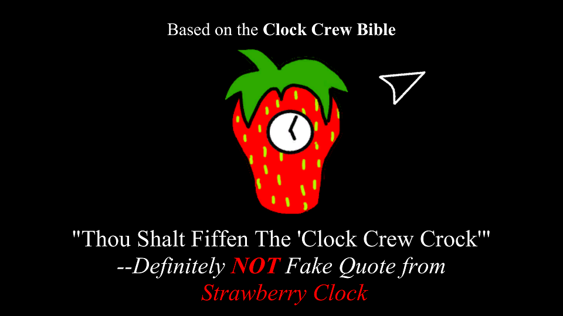
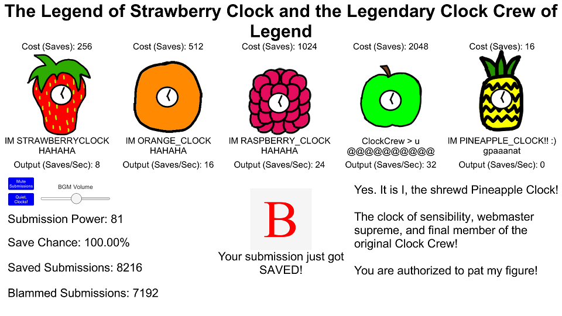

# Clock Crew Crock

> *Try saying THAT 10 times really fast*

An interactive retelling of [Newgrounds](https://www.newgrounds.com) [Portal History](https://www.newgrounds.com/wiki/about-newgrounds/history/flash-portal-history?path=/wiki/about-newgrounds/history/flash-portal-history) and the [Clock Crew](https://www.newgrounds.com/collection/clockcrew) from the perspective of [Strawberry Clock](https://strawberryclock.newgrounds.com/).

### About

Clock Crew Crock (AKA CCC) was made for [Clock Day 2021](https://www.newgrounds.com/collection/clockday2021)  
(a celebration that occurs every August 15th - there's a whole [history](https://www.newgrounds.com/collection/clockcrewhistory)).

Strictly speaking, CCC is a clicker/incremental game, but it plays more like an interactive story (that is mostly apocryphal and entirely satirical!).

Since I don't really like incremental games that are either endless or take a long time to finish (eg: longer than a week), this game is short and sweet. (Like a strawberry!)
You can beat it in under 5 minutes.

## Satire (for the game submission)

### Game Description

Join us on a legendary legend of legendary proportions about the legendary Strawberry Clock, leader of the legendary Clock Crew, and their legendary exploits.

Click your way through Portal History, following "A" beginning of Strawberry Clock trying to "B" the best King of the Portal that he can "B".

Learn of the Herculean tasks undertaken by the Clock Crew to bring peace and love to all the mouth-breathing simpletons &mdash;I mean intelligent, honored users of Newgrounds.

This will be the most amazing game that you will ever play in your life. Vote 5. Also, make sure you beat it. It only takes a couple minutes. And remember to vote 5.  
Actually, you don't even have to play the game. Just vote 5 and favorite it.  
DO IT NOW. VOTE 5.

By the way, if you're wondering why the quality seems low, that's intentional.  
Yep.  
Definitely not due to a lack of effort on my part.  

### Motivation

Since the original idea of Clock Day was to submit something that appears poorly made yet is humorous and satirical (I think), this is probably a suitable submission. Maybe.

> "If you put in more than 50 dollars worth of effort you aren't doing it right.  
> Unless you did it to make it look like you didn't put in that much effort in which case you ARE doing it right."  
> *-- FLOUNDERMANCLOCK*

I like to think this is an example of the latter.  
But if you think that this game looks like garbage and took no effort to make, then you should still vote 5 in the spirit of Clock Day.

And Thus Spake The Legendary Strawberry Clock:
> "Thou Shalt Fiffen The 'Clock Crew Crock'"  
> *-- Definitely NOT Fake Quote from Strawberry Clock*

### Crock

*From an absolutely, totally, indisputably, legitimate source of nollij proofread by men of culture, learning, and academia*

> Definition
> 1. nonsence, hogwash, bilge, absolute bull, a waste of time and/or money, a sham. It's bogus - totally.
> 2. a container, such as a pot or kettle. This type of vessel is often used for cooking or washing or concocting or mixing.
> 3. brand name for a certain type of electric cooking pot that will cook delicious meals for during the day while you are occupied with other things. Just stir the food up every once in a while. Versatility and technology together!  
 
> *-- Urban Dictionary*